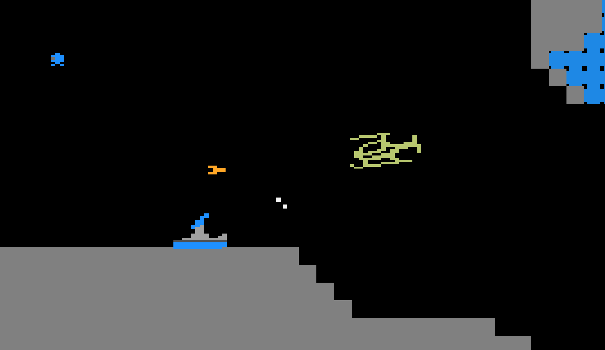
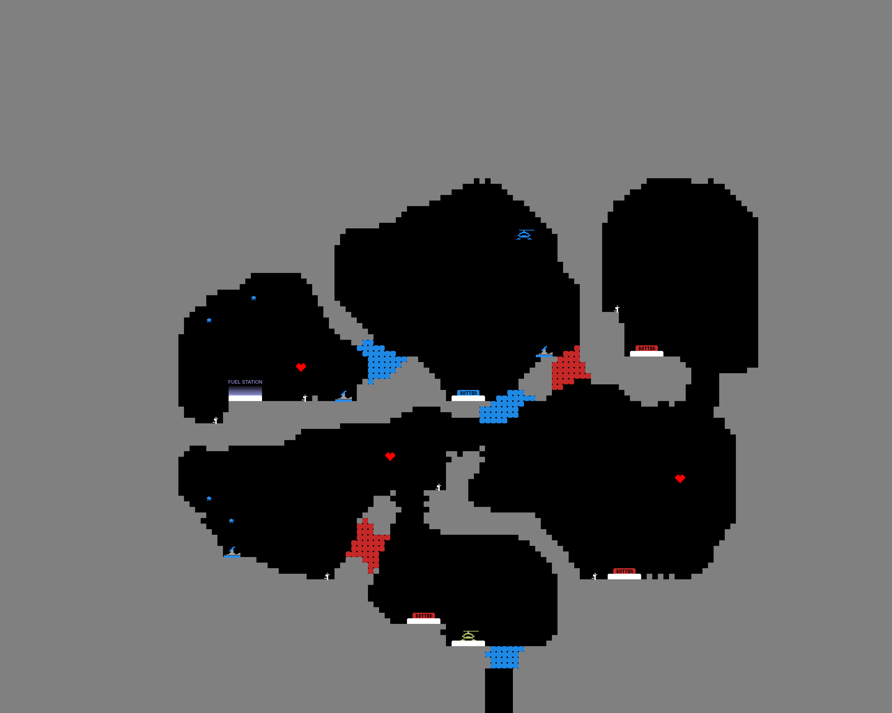

# Rescue Elite

In this project, we create a website version of the game **Fort Apocalypse** of the C64. The game is about an helicopter trying to rescue people in an active warzone. To do so, the chopper must shoot enemies and press buttons to open doors. The goal is to rescue the people and escape the level.



## Features
This game includes several features:
- One pre-made tutorial level.
- A number of AI generated levels.
- An import function in the settings menu.
- A level editor allowing players to create, share, and export custom levels.

### Goal: Replayability
Our goal is to make the game replayable by implementing an algorithm to generate new levels (using PCG). The levels created by this algorithm can be imported into this game and be played. The levels featured in this game are (except for the tutorial level) all generated using this method.

## Thesis Project
This game is part of my thesis project on replayability and AI-driven level design. Using Monte Carlo Tree Search (MCTS), we generate level structures (as a Graph) which are translated into a playable level. This level can be imported and played. Here is an example of a level generated by our methods. This is level 6 in the level selector.




## How to Play?
- Use arrow keys to move the chopper (or use the joystick on mobile).
- Shoot enemies or breakable blocks using 'X' or 'Z' (or the "SHOOT" button on mobile).
- Press the colored buttons to open respective colored doors.
- Avoid or fight enemies.
- Rescue the people and reach the exit to complete the level.

## How to setup?
This application can be launched in two different ways:

### Node.js
The first method is to use Node.js. Activate the program using the following command:
```node server.js```
The server is opened on port `3000`. Here the game can be played.

For the level editor the command is as follows:
```node server_editor.js```
And this can be opened on port `3001`.

#### Play locally
To play the game locally on your network (eg. on your mobile phone), you can use the following setup for Windows 11.

1. Open powershell as administrator and run: `New-NetFirewallRule -DisplayName "Node WSL" -Direction Inbound -Action Allow -Protocol TCP -LocalPort 3000`
2. Get the IP from powershell using `ipconfig` and look under "Wireless LAN adapter WiFi" at `IPv4 Address. . . . . . . . . . . : 192.168.???.???` and copy this address.
3. Run the node server in WSL linux/ubuntu.
4. Open the website using `<IPv4 Address>:3000` on other devices which are connected to the same wifi.
Only do this on a private network.

### VSCode Live Server
Visual Studio Code has an option to run a html-file in a live server. In order to do so, open the project in VSCode and open the `public/` directory. Right click on the `index.html` file and click on the first option: `Open with Live Server`. This works similar for the level editor which is located in the `public_editor/` directory.

## Where to Play?
You can play a version of this game on: https://rescueelite.onrender.com.

## Original Game
This game is based on Fort Apocalypse (by Steve Hales). A public version can be found at: https://github.com/heyigor/FortApocalypse

There have been modifications made to the original game making it different. This game is only created for research purposes.
